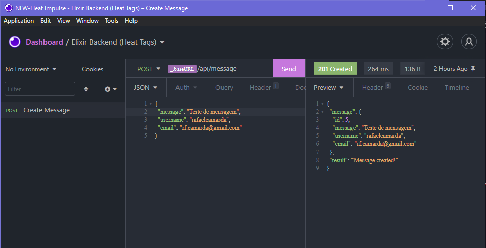

# NLW-Heat - Impulse Track - Elixir Backend

NLW-Heat backend project in Elixir with Phoenix and Quantum

## API call example

<p align="center"></p>

## Technologies

- Elixir
- Phoenix
- Quantum
- Ecto
- Insomnia.REST

## Instructions for clonning and running this project

Execute the following commands to get the project up and running:

```bash
git clone https://github.com/jobsonita/rocketseat_nlw_heat_impulse_elixir.git

# wait for git to finish clonning the project, then navigate to the folder and install the dependencies:

cd rocketseat_nlw_heat_impulse_elixir

mix deps.get
mix deps.compile
```

After this is done, configure the database credentials and connection (we're using PostgreSQL in this project) and secret key base in `config/dev.exs`.

Then, create the database and run the migrations:

```bash
mix ecto.create

mix ecto.migrate
```

Finally, run the server:

```bash
mix phx.server
```

Open Insomnia and import the [Insomnia requests file](tools/Insomnia_Requests_2021-10-23.json). Execute the available request to send messages to the api.

<p align="center"></p>

Aditionally, the server is configured to generate a map of word frequencies everyday at midnight and output it to the console. You can change this behaviour in [config/config.exs](config/config.exs) by using the available options listed in [Quantum's documentation](https://hexdocs.pm/quantum/configuration.html#content).

You can also execute the interactive elixir cli at the root folder and call the word frequency function directly:

```bash
iex -S mix
## notice: use iex.bat instead when running in a windows machine

## Interactive Elixir (1.12.3)
# iex(1)>
RocketseatNlwHeatImpulseElixir.Tags.Count.call

## Output:
# %{
#   "this" => 1,
#   "is" => 1,
#   "a" => 1,
#   "list" => 1,
#   "of" => 2,
#   "words" => 1,
#   "in" => 1,
#   "the" => 1,
#   "stored" => 1,
#   "messages" => 1,
#   "and" => 1,
#   "their" => 1,
#   "number" => 1,
#   "occurrances" => 1
# }
```
